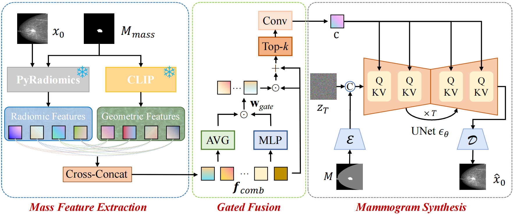

# Joint Holistic and Lesion Controllable Mammogram Synthesis via Gated Conditional Diffusion Model
### IJCNN 2025

This is official PyTorch implementation of our Gated Conditional Diffusion Model (GCDM) for controllable mammogram synthesis. For technical details, please refer to:

Joint Holistic and Lesion Controllable Mammogram Synthesis via Gated Conditional Diffusion Model. [IJCNN 2025]

Overall Framework of the proposed GCDM:
<p align="center">
  
</p>


##  Requirements
```
conda create -n GCDM python=3.9
conda activate GCDM
pip install -r requirements.txt
git clone https://github.com/CompVis/taming-transformers.git
pip install -e taming-transformers/
git clone https://github.com/openai/CLIP.git
pip install -e CLIP/
```

## Usage

### Training

```
source train.sh
```
### Inference
```
python inference.py
```
### evaluation

```
python evaluation.py
```

## Results

Visual results on the VinDr-Mammo dataset. We compare our GCDM with several SOTA methods, i.e., SPADE, pSp, SR3, Controlnet and Seg-Diff.
Our approach provides superior visual quality in terms of realism, lesion consistency, and anatomical coherence.

<p align="center">
  
</p>
