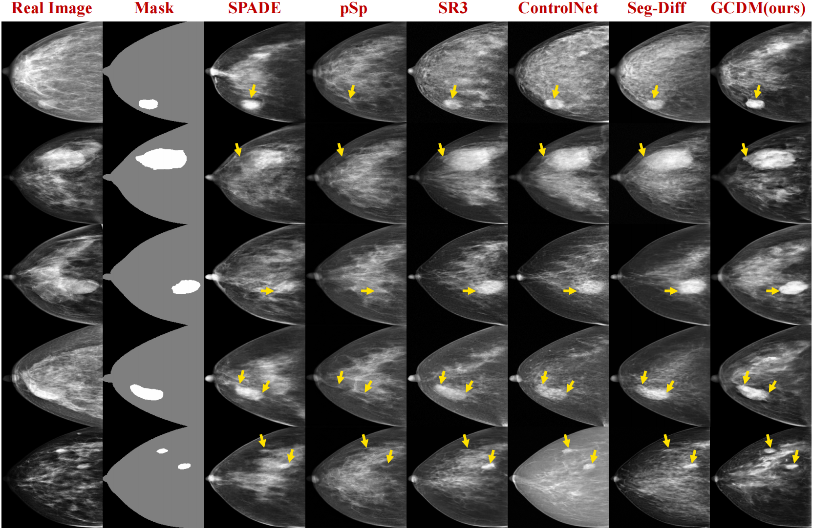

# Joint Holistic and Lesion Controllable Mammogram Synthesis via Gated Conditional Diffusion Model
### ACMMM 2025

This is official PyTorch implementation of our Gated Conditional Diffusion Model (GCDM) for controllable mammogram synthesis. For technical details, please refer to:

Joint Holistic and Lesion Controllable Mammogram Synthesis via Gated Conditional Diffusion Model. 

Overall Framework of the proposed GCDM:
<p align="center">
  
</p>


##  Requirements
```
conda create -n GCDM python=3.9
conda activate GCDM
pip install -r requirements.txt
git clone https://github.com/CompVis/taming-transformers.git
pip install -e taming-transformers/
git clone https://github.com/openai/CLIP.git
pip install -e CLIP/
```

## Usage

### Dataset
Please divide paired images and masks by train, val, and test. For example:

``` 
DATA_FOLDER
├── images
│   ├── train
│   ├── val
│   └── test
└── masks
    ├── train
    ├── val
    └── test
```
The matched image and mask have the same name, mask values are in [0, 1, 2], 0 for background, 1 for foreground, and 2 for lesions. The Mass Radiomic Features are stored in 'files/trainset_normalized.csv', 'files/valset_normalized.csv', and 'files/testset_normalized.csv', respectively.

### Training
Download image-conditioned stable diffusion checkpoint:  
`wget https://cv.cs.columbia.edu/zero123/assets/sd-image-conditioned-v2.ckpt`

```
source train.sh
```
config file is in 'configs/train.yaml', you can modify the parameters in the file.
### Inference
```
python inference.py
```
### evaluation

```
python evaluation.py
```

## Results

Visual results on the VinDr-Mammo dataset. We compare our GCDM with several SOTA methods, i.e., SPADE, pSp, SR3, Controlnet and Seg-Diff.
Our approach provides superior visual quality in terms of realism, lesion consistency, and anatomical coherence.

<p align="center">
  
</p>
